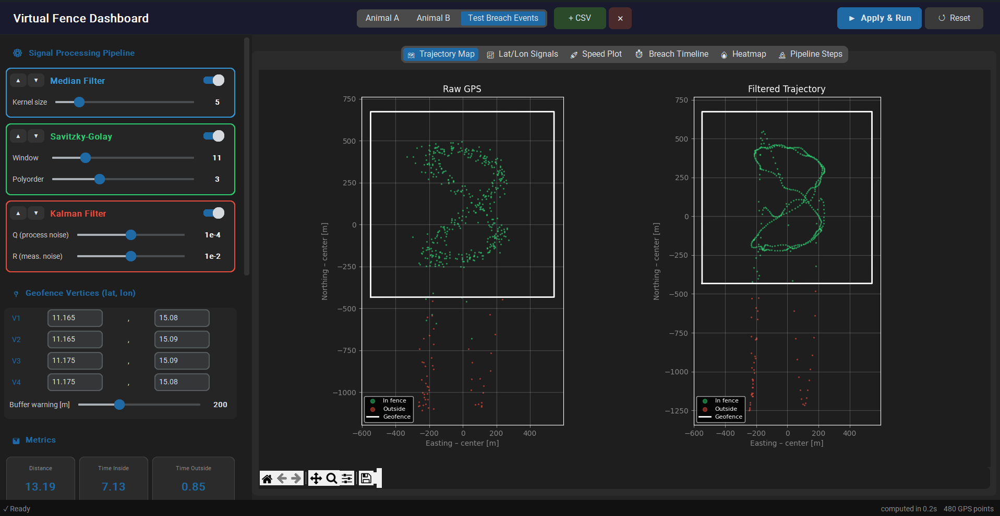

# gps-fence

GPS trajectory analysis tool for geofence breach detection. Features a 3-stage signal filtering pipeline (Median → Savitzky-Golay → Kalman) with an interactive desktop dashboard for real-time parameter exploration.



## Features

- **3-stage signal filtering pipeline** – Median → Savitzky-Golay → Kalman, applied sequentially with live parameter sliders
- **Geofence breach detection** – Ray-casting point-in-polygon with configurable warning buffer zone
- **Interactive GUI** – Built with CustomTkinter; adjust all filter parameters in real time without restarting
- **Reorderable pipeline** – Drag filters up/down to change their order and observe the effect
- **6 visualization tabs** – Trajectory map, lat/lon signals with residuals, speed plot, breach timeline, KDE heatmap, pipeline step overlay
- **Snapshot comparison** – Save named analysis states and compare metrics side-by-side
- **Custom dataset loading** – Load any Movebank-format CSV via the `+ CSV` button
- **PNG export** – Save all 6 plots at 150 DPI with one click

## Installation

Python 3.12+ is required.

```bash
pip install -r requirements.txt
```

## Usage

```bash
python dashboard.py
```

The dashboard loads two built-in cattle datasets (Animal A, Animal B) from `data/`. Switch between them using the segmented button in the top bar.

To run the batch analysis and export all plots without the GUI:

```bash
python virtual_fence.py
```

To regenerate the synthetic test datasets:

```bash
python generate_test_data.py
```

## Input data format

The application expects CSV files in Movebank standard format:

| Column | Description |
|---|---|
| `timestamp` | UTC datetime, e.g. `2024-01-15 06:00:00.000` |
| `location-lat` | Latitude in decimal degrees (WGS84) |
| `location-long` | Longitude in decimal degrees (WGS84) |
| `ground-speed` | Speed in m/s (optional) |

## Signal processing pipeline

| Stage | Method | Purpose |
|---|---|---|
| 1 | **Median filter** (kernel 3–15) | Remove GPS impulse noise (position jumps) |
| 2 | **Savitzky-Golay** (window 5–31) | Smooth Gaussian noise while preserving signal shape |
| 3 | **Kalman filter** (tunable Q/R) | Correct slow drift using a position+velocity state model |

Coordinates are converted from WGS84 lat/lon to UTM meters (auto zone detection via pyproj) before geofence operations.

## Dataset

The built-in data comes from the publicly available Movebank CC0 dataset:

> Moritz M, Scholte P, Hamilton I M, Kari S, Loft L, Schmitt C, Taddese G, Zandvliet B (2018).  
> **Daily grazing movements of cattle in the Far North Region, Cameroon.**  
> Movebank Data Repository. https://doi.org/10.5441/001/1.3nj3qj45

Two individual animals are provided (`data/animal_A.csv`, `data/animal_B.csv`) covering ~12h of movement near Lake Logone, Cameroon (11.14–11.17°N, 15.08–15.10°E).

Synthetic test files (clean, spike noise, Gaussian noise, drift, combined, breach events) can be regenerated with `generate_test_data.py`.

## Project structure

```
virtual_fence.py        # core signal processing library
dashboard.py            # CustomTkinter GUI application
generate_test_data.py   # synthetic test data generator
requirements.txt        # Python dependencies
ARCHITECTURE.md         # technical architecture documentation
data/                   # input CSV files (git-ignored)
wyniki/                 # output plots and metrics (git-ignored)
```

## License

MIT License – see [LICENSE](LICENSE).

Data files are released under CC0 by their respective authors (see Dataset section above).
